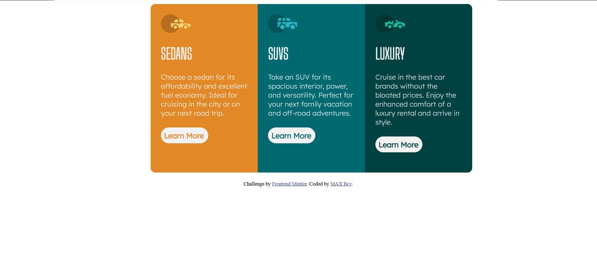

# Frontend Mentor - 3-column preview card component solution

This is a solution to the [3-column preview card component challenge on Frontend Mentor](https://www.frontendmentor.io/challenges/3column-preview-card-component-pH92eAR2-). Frontend Mentor challenges help you improve your coding skills by building realistic projects. 

## Table of contents

- [Overview](#overview)
  - [The challenge](#the-challenge)
  - [Screenshot](#screenshot)
  - [Links](#links)
- [My process](#my-process)
  - [Built with](#built-with)
  - [What I learned](#what-i-learned)
  - [Continued development](#continued-development)
  - [Useful resources](#useful-resources)
- [Author](#author)
- [Acknowledgments](#acknowledgments)

## Overview

### The challenge

Users should be able to:

- View the optimal layout depending on their device's screen size
- See hover states for interactive elements

### Screenshot

### Links

- Solution URL: [https://github.com/MAXbcv/3-column-preview-card-component]
- Live Site URL: [https://maxbcv.github.io/3-column-preview-card-component/]

## My process

### Built with

- Semantic HTML5 markup
- CSS custom properties
- Mobile-first workflow

### What I learned
This project allowed me to:
- Structure an HTML page clearly and accessibly
- Apply responsive CSS using Flexbox
- Deploy a static website using GitHub Pages

### Continued development

I’d like to explore further:
- Learn more about CSS Grid
- Master different CSS and HTML techniques
- Deepen my understanding of the inner workings and subtleties of HTML and CSS

## Author

- GitHub : [@MAXbcv](https://github.com/MAXbcv)
- Frontend Mentor : [@MAXbcv](https://www.frontendmentor.io/profile/MAXbcv)

## Acknowledgments

Thanks to the Frontend Mentor community for the inspiration and the many shared examples. This challenge helped me improve my web development skills
